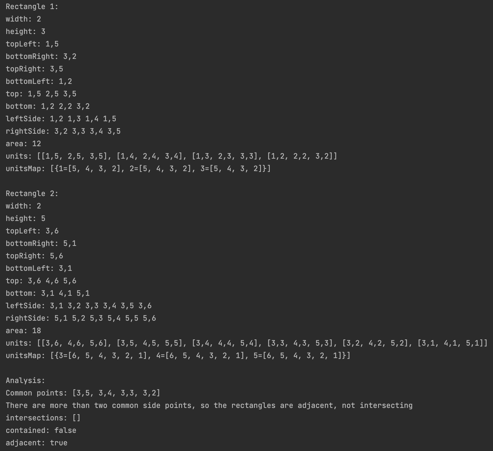

# Geometry Service
A Spring Boot command line application that takes in points representing corners of two rectangles, then prints to the console information describing their spatial relationship.

## Explanation
When provided with the top left and bottom right corner points of two rectangles that lie on an axis that consists only positive integers, Geometry Service provides the following information:
1. All recorded information of each rectangle, including sides, area, and all the points it occupies.
2. An analysis of their spatial relationship including:
   1. Common points the two rectangles share.
   2. The points of intersection if there are any.
   3. Whether one rectangle is contained in the other.
   4. Whether the rectangles are adjacent.

## What you need
- Gradle
- JRE

## Instructions
First build the jar file:

`./gradlew build`

Then run the jar file, passing in four space-separated arguments that represent:
1. The x,y value of the top left corner of rectangle 1
2. The x,y value of the bottom right corner of rectangle 1
3. The x,y value of the top left corner of rectangle 2
4. The x,y value of rht bottom right corner of rectangle 2

` java -jar build/libs/geometry-0.0.1-SNAPSHOT.jar 1,5 3,2 3,6 5,1`
